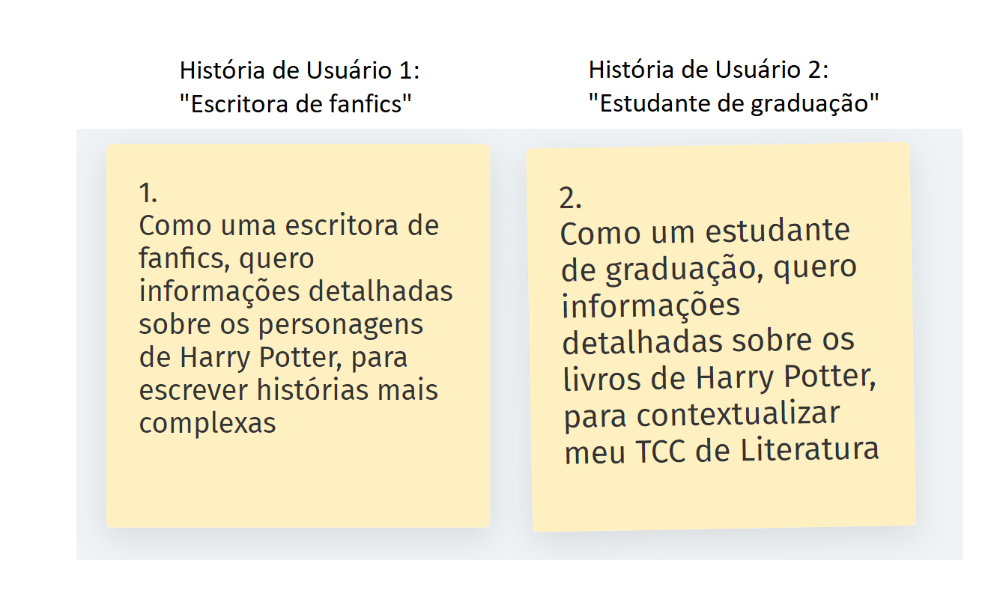
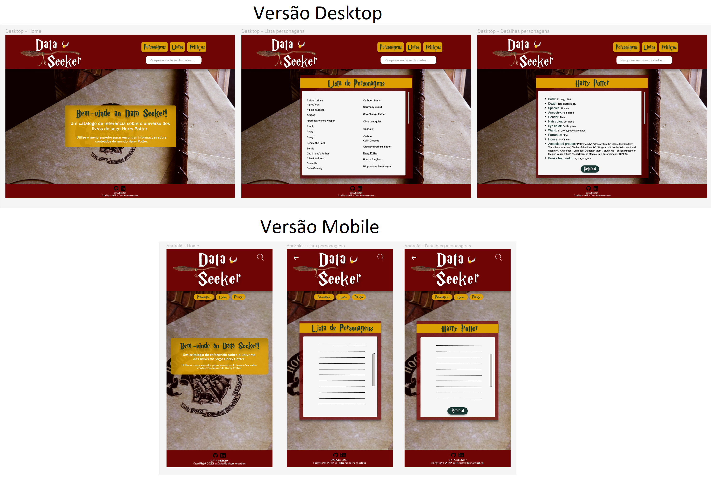

# Data Lovers

## Índice

* [1. Resumo do projeto](#1-resumo-do-projeto)
* [2. Histórias de usuário](#2-histórias-de-usuário)
* [3. Processo de prototipação](#3-processo-de-prototipação)
* [4. Testes de usabilidade](#4-testes-de-usabilidade)
* [5. Resultado final do protótipo](#5-resultado-final-do-protótipo)
* [6. Objetivos e funcionamento da aplicação](#6-objetivos-e-funcionamento-da-aplicação)
* [7. Testes unitários](#7-testes-unitários)
* [8. Ferramentas](#8-ferramentas)

***

## 1. Resumo do projeto
O Data-lovers é o segundo projeto de uma _página web_, desenvolvido durante o Bootcamp da turma SAP008, da Laboratória Brasil. Este projeto é uma aplicação web de manipulação de um banco de dados previamente disponibilizado no repositório da Laboratória. Para o nosso projeto, escolhemos trabalhar com os dados da temática Harry Potter. 

Para a elaboração do projeto, utilizamos as ferramentas Notion (para o planning semanal), Metroretro (para a construção das histórias de usuários e para as retrospectivas de nossas sprints) e Figma (para o protótipo navegável de alta fidelidade e testes de usabilidade). Para a criação da página, utilizamos HTML, CSS, Jest, Vanilla JavaScript, Git e GitHub.

Foram criadas histórias de usuário para auxiliar na elaboração das features que íriamos incluir no projeto, bem como um protótipo de alta fidelidade navegável incluindo essas features. Através deste protótipo, pudemos realizar testes de usabilidade, e com base no feedback dos usuários aplicamos mudanças neste protótipo para a criação de um projeto que atendesse às necessidades reais dos usuários.

## 2. Histórias de usuário
As histórias dos nossos usuários foram pensadas de acordo com a temática que escolhemos, a da saga de livros "Harry Potter", da autora J.K Rolling. Criamos as histórias considerando como nossa página poderia entregar um valor particular a esses usuários, ao atender suas demandas e necessidades.  

Para a escrita das histórias, escrevemos descrições breves, claras e diretas sobre as necessidades dos nossos usuários: 

## 3. Processo de prototipação
O processo de prototipação foi a segunda etapa realizada durante a estruturação do projeto, depois da criação de histórias de usuário. Primeiramente criamos o protótipo de baixa fidelidade e depois o protótipo de alta fidelidade, com ambas versões Mobile e Desktop e por fim foi desenvolvido o protótipo de alta fidelidade navegável. 

Adotamos uma perspectiva de Design Responsivo para criação de nosso protótipo no Figma com a prática de design Mobile First, de modo que, primeiramente, criamos nosso protótipo em versão Mobile, e, com base nesses resultados, prototipamos nossa versão Desktop. Implementando as seguintes mudanças:

1. Elegemos nossos elementos de design (paleta de cores, fonte, imagem de fundo, nome e logo) para que trouxessem o elemento de identidade que remetesse ao universo dos livros da saga;
2. Disposição dos dados principais em listas, visando organização e facilidade para a consulta e escolha dos dados pelo usuário;
3. Disposição dos dados informativos em cards, objetivando maior conforto e precisão na leitura do texto;
4. Incluímos um botão de "Retornar", para facilitar a navegação do usuário para a página anterior, caso necessitasse consultar informativos de outros dados principais;

## 4. Testes de usabilidade
Durante a criação do protótipo de alta fidelidade, conduzimos um teste de usabilidade com dois usuários, com o objetivo de verificar se o protótipo que estávamos criando atenderia às funcionalidades esperadas. Para o teste, propomos aos usuários a tarefa de acessar o card que exibe informações detalhadas do personagem "Harry Potter", utilizando o prototipo navegável.

Após a realização dos testes, solicitamos aos usuários seus feedbacks com relação à usabilidade do prototipo, considerando os níveis de acessibilidade e intuitividade apresentados na página, bem como a viabilidade da tarefa proposta em si. Com o feedback, buscamos entender quais dificuldades eles encontraram; quais features da página apresentaram maior valor; qual feature faltava para que a experiência deles tivesse maior valor; e se tinham sugestões, de acordo com suas necessidades, para que a experiência fosse ainda mais positiva e intuitiva. 

O fluxo de navegação ocorreu tranquilamente, no entanto recebemos outros feedbacks que fizeram com que adaptássemos nosso protótipo. Após análise dos feedbacks obtidos, implementamos as seguintes adições e mudanças ao projeto:

1. Aumentamos o tamanho das fontes e dos botões;
2. Adicionamos uma seção introdutória, com descrição sobre a funcionalidade da aplicação, à nossa página inicial, a modo de contextualizar e informar ao usuário do que se tratava nossa página web;
3. Mudamos nossa paleta de cores para tons mais escuros, a modo de proporcionar maior conforto na leitura do usuário;
5. Organizamos a disposição dos elementos das listas em ordem alfabética, a modo de facilitar a pesquisa e visualização do dado desejado pelo usuário;
6. Trocamos o fundo animado por uma imagem estática, a modo de proporcionar maiores padrões de acessibilidade para o usuário durante a leitura dos conteúdos da página; 

## 5. Resultado final do protótipo
Após todas as etapas do processo de prototipação, e da inclusão de mudanças com base nos feedbacks obtidos no teste de usabilidade, nosso protótipo chegou no resultado exibido abaixo: 

Versões Desktop e Mobile:

## 6. Objetivos e funcionamento da aplicação 
Com base nas histórias de usuários que obtivemos, os maiores interesses de nossos usuários seria de conseguir acessar dados acerca dos personagens, feitiços e livros da saga Harry Potter.

Para sanar essas demandas o funcionamento da página acontece a partir de três filtros principais: o de "Personagens", o de "Livros" e o de "Feitiços", todos exibidos em botões na página inicial da aplicação. Ao clicar em um dos botões desejados, o usuário será direcionado a uma página com uma lista de exibição para cada um dos filtros que selecionamos; a partir desta lista, o usuário poderá escolher qual informação deseja acessar através de links de direcionamento em cada um dos elementos da lista, os quais o direcionará para uma página com display de um card com dados detalhados a respeito do conteúdo escolhido pelo usuário.  

A príncipio iríamos incluir uma barra de pesquisa onde o usuário pudesse pesquisar qualquer termo em toda a base de dados. Embora fosse uma feature de alto valor para o usuário, não era um item obrigatório do projeto e era uma task de alta dificuldade entre as outras tasks opcionais. Optamos por priorizar a implementação de features obrigatórias e tirar a barra de pesquisa das features a serem incluídas.

Os seguintes dados estarão disponibilizados dentro de cada filtro/seção, como pode ser observado abaixo:
   1. _"Personagens"_ 
   Nesta seção, o usuário poderá acessar dados detalhados sobre cada um personagem, tais quais: data de nascimento; data da morte; espécie; ancestralidade; gênero; cor do cabelo; cor dos olhos; tipo de varinha mágica; patrono; casa de Hogwarts a qual pertence; grupos associados; em quais livros aparece.
   2. _"Livros"_ 
   Nesta seção, o usuário poderá acessar dados detalhados sobre cada um dos livros da saga, sendo elas: título da obra; data de lançamento; autoria; sinopse.
   3. _"Feitiços"_ 
   Nesta seção, o usuário poderá acessar dados detalhados sobre cada um dos feitiços utilizados na saga, tais como: nome; variação de nome; pronúncia; descrição; menção; etimologia; notas.

   
### 7. Testes unitários
Optamos por criar testes unitários para todas as funções de data.js, implementando os testes juntamente com as funções para corrigir possíveis bugs. Os testes unitários realizados neste projeto tem 100% de cobertura, inclusas as categorias: statements, functions e lines. 

#### 8. Ferramentas
* [Git](https://git-scm.com/)
* [GitHub](https://github.com/)
* [GitHub Pages](https://pages.github.com/)
* [Node.js](https://nodejs.org/)
* [Jest](https://jestjs.io/)
* [Visual Studio Code]
* [Figma]
* [Notion]
* [Metroretro]

